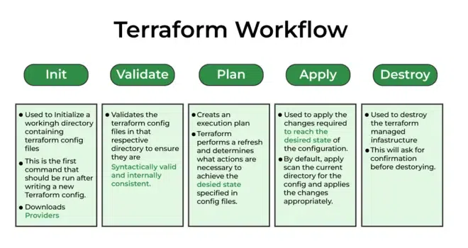

# 🛠️ Terraform Workflow 



Terraform follows a structured lifecycle for provisioning and managing infrastructure efficiently and safely. Below is a detailed breakdown of each phase:

---

## 1. 🔧 `terraform init` – Initialization Phase

### ✅ Purpose:
Initializes a working directory with Terraform configuration.

```bash
terraform init
````

### 🔍 Internal Actions:

* Downloads and installs required provider plugins.
* Initializes remote backend if defined (e.g., S3).
* Creates `.terraform/` directory for local cache and metadata.

### 💡 Real-Time Example:

```hcl
provider "aws" {
  region = "us-east-1"
}
```

---

## 2. 🧪 `terraform validate` – Configuration Check

### ✅ Purpose:

Validates syntax and internal references in `.tf` files.

```bash
terraform validate
```

### 🔍 Internal Actions:

* Checks HCL syntax.
* Verifies internal references (variables, modules).
* Ensures all configurations are consistent.

> ❗ Note: Does not connect to AWS or validate infrastructure.

---

## 3. 📐 `terraform plan` – Execution Planning

### ✅ Purpose:

Generates an execution plan to show what will be created, updated, or destroyed.

```bash
terraform plan
```

### 🔍 Internal Actions:

* Refreshes state (by default).
* Compares actual AWS resources with desired config.
* Outputs changes without applying them.

### 💡 Optional:

```bash
terraform plan -out=tfplan
```

---

## 4. 🚀 `terraform apply` – Provision Infrastructure

### ✅ Purpose:

Applies the planned changes to reach the desired state.

```bash
terraform apply
```

### 🔍 Internal Actions:

* Reads plan (or generates new one).
* Calls AWS API to create/update resources.
* Updates `.tfstate` file with new infrastructure info.

> ⚠️ Use `-auto-approve` only in CI/CD pipelines with caution.

---

## 5. 🔥 `terraform destroy` – Tear Down Infrastructure

### ✅ Purpose:

Safely destroys all resources tracked by Terraform.

```bash
terraform destroy
```

### 🔍 Internal Actions:

* Calculates destruction plan.
* Removes infrastructure using AWS APIs.
* Updates state file accordingly.

> Use in **non-prod environments** or cleanup jobs.

---

## 🔄 Summary of Terraform Workflow

| Phase      | Command              | Purpose                                         |
| ---------- | -------------------- | ----------------------------------------------- |
| `init`     | `terraform init`     | Initialize provider and backend                 |
| `validate` | `terraform validate` | Validate syntax and internal consistency        |
| `plan`     | `terraform plan`     | Preview what Terraform will do                  |
| `apply`    | `terraform apply`    | Apply and provision infrastructure              |
| `destroy`  | `terraform destroy`  | Tear down and delete all managed infrastructure |

---

## 💡 Best Practices

* Store state in S3 + use DynamoDB for locking in teams.
* Use `terraform plan` before `apply` to avoid surprises.
* Never hardcode credentials; use profiles or environment variables.
* Isolate dev/test/prod with separate workspaces or folders.
* Use modules to reuse VPC, EC2, RDS logic cleanly.


